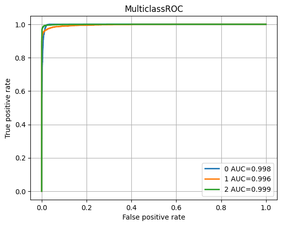

# GSOC 2025 — DeepLense | ML4SCI

> Applying state-of-the-art deep learning to gravitational lensing image analysis for the [ML4SCI](https://ml4sci.org/) organization.

---

## Table of Contents

- [Overview](#overview)
- [Tasks Summary](#tasks-summary)
- [Results at a Glance](#results-at-a-glance)
- [Repository Structure](#repository-structure)
- [Setup](#setup)
- [Task 1 — Multi-Class Classification](#task-1--multi-class-classification)
- [Task 3A — Super-Resolution (Synthetic)](#task-3a--super-resolution-synthetic)
- [Task 3B — Super-Resolution (Real Images)](#task-3b--super-resolution-real-images)
- [Task 4 — Diffusion Model Generation](#task-4--diffusion-model-generation)
- [Task 6 — Foundation Model (MAE)](#task-6--foundation-model-mae)
- [Modular Source Code](#modular-source-code)
- [Pre-trained Models](#pre-trained-models)
- [About](#about)

---

## Overview

This repository contains solutions for **Tasks 1, 3A, 3B, 4, 6A, and 6B** of the DeepLense GSOC 2025 challenge. The project covers the full ML pipeline — from classification and generation to self-supervised pre-training — all applied to the domain of **strong gravitational lensing**.

| Domain | Approach |
|--------|----------|
| Classification | ResNet18, MaxViT |
| Super-Resolution | SRCNN, EDSR, HAT, DIPNet, WaveMixSR, RCAN, SRGAN |
| Generative Modeling | Denoising Diffusion Probabilistic Models (DDPM) |
| Foundation Model | Masked AutoEncoder (MAE) on ViT backbone |

---

## Tasks Summary

| Task | Description | Best Model | Key Metric |
|------|-------------|------------|------------|
| **1** | Multi-class lensing classification | MaxViT | AUC = 0.9977 |
| **3A** | Super-resolution on synthetic images | DIPNet | PSNR = 42.4 dB |
| **3B** | Super-resolution on real images | RCAN | PSNR = 41.98 dB |
| **4** | Diffusion model for image generation | DDPM | FID = 15.89 |
| **6A** | MAE pre-training + classification | MAE + ViT | Accuracy = 99.44% |
| **6B** | MAE pre-training + super-resolution | MAE + Conv Decoder | PSNR = 40.36 dB |

---

## Results at a Glance

### Task 1 — ROC Curve (MaxViT)


### Task 3A — Super-Resolution Sample Output


### Task 3B — Real Image Examples


### Task 4 — Diffusion Model Progress

| Epoch 1 | Epoch 50 |
|---------|----------|
|  |  |

### Task 6 — MAE Reconstruction Progress

| Epoch 1 | Epoch 100 |
|---------|-----------|
|  |  |

> Each row: masked input → reconstructed → ground truth.

### Task 6 — Multi-Class ROC (MAE Encoder)


---

## Repository Structure

```
GSOC/
├── README.md
├── requirements.txt
│
├── src/                            # Modular Python source code
│   ├── utils/
│   │   ├── common.py               # SR building blocks (ResBlock, RRDB, CALayer, etc.)
│   │   ├── basicblock.py           # EDSR-style blocks (BasicBlock, Upsampler)
│   │   └── metrics.py              # PSNR, SSIM, AverageMeter
│   └── models/
│
├── Task1/
│   ├── main_pipeline.ipynb         # Full training pipeline
│   ├── ROC.png
│   └── readme.md
│
├── Task3 - SuperResolution/
│   ├── task3.ipynb                 # SRCNN, EDSR, HAT, DIPNet training
│   ├── task3_HAT.ipynb
│   ├── best_model_Superres.pth
│   └── readme.md
│
├── Task3B - RealiImages SuperResolution/
│   ├── task3b.ipynb                # Main SR training
│   ├── task3b_best.ipynb
│   ├── task3b_RCAN.ipynb
│   ├── common.py                   # (mirrored in src/utils/common.py)
│   ├── basicblock.py               # (mirrored in src/utils/basicblock.py)
│   ├── *.pth                       # Trained weights
│   └── readme.md
│
├── Task4 - Diffusion Model/
│   ├── main.ipynb
│   ├── 0000.png / 0049.png
│   └── readme.md
│
└── Task6 - Foundational Model/
    ├── mae_train.ipynb             # MAE pre-training
    ├── mae_multiclass.ipynb        # Classification fine-tuning
    ├── mae_superres_v2.ipynb       # SR with MAE encoder
    ├── mae_superres_v3.ipynb
    ├── *.png                       # Result visualizations
    └── readme.md
```

---

## Setup

```bash
git clone https://github.com/arnesh2212/DeepLense.git
cd DeepLense
pip install -r requirements.txt
```

Then launch Jupyter and navigate to the relevant task notebook:

```bash
jupyter notebook
```

**GPU recommended.** All models were trained on CUDA. CPU inference is supported but slow.

---

## Task 1 — Multi-Class Classification

**Goal:** Classify strong lensing images into three categories:

| Class | Description |
|-------|-------------|
| 0 | No substructure |
| 1 | Subhalo substructure |
| 2 | Vortex substructure |

**Models & Results:**

| Model | Val AUC |
|-------|---------|
| ResNet18 (Modified) | 0.9735 |
| MaxViT | 0.9789 → **0.9977** (final) |

**Per-class AUC (MaxViT):**

| Class 0 | Class 1 | Class 2 | Mean |
|---------|---------|---------|------|
| 0.9977 | 0.9962 | 0.9993 | **0.9977** |

**Training details:**
- Data augmentation (flips, rotations, color jitter)
- Cosine Annealing LR scheduler
- LR reduction on plateau
- ImageNet pre-trained weights

**Notebook:** [Task1/main_pipeline.ipynb](Task1/main_pipeline.ipynb)

---

## Task 3A — Super-Resolution (Synthetic)

**Goal:** Upscale low-resolution synthetic gravitational lensing images using ground-truth HR pairs.

| Model | Val MSE | Val PSNR (dB) | Val SSIM |
|-------|---------|---------------|----------|
| SRCNN | 6.08e-05 | 42.3 | 0.974 |
| EDSR | 5.95e-05 | 42.2 | 0.973 |
| HAT | 5.97e-05 | 42.0 | 0.975 |
| **DIPNet** | **5.85e-05** | **42.4** | **0.977** |

**Best model: DIPNet** — efficient architecture with strong performance under limited compute.

**Reference:** [DIPNet](https://github.com/xiumu00/DIPNet)

**Notebook:** [Task3 - SuperResolution/task3.ipynb](Task3%20-%20SuperResolution/task3.ipynb)

---

## Task 3B — Super-Resolution (Real Images)

**Goal:** Upscale real-world gravitational lensing images — a harder problem due to domain noise and lack of clean HR references.

| Model | Val MSE | Val PSNR (dB) | Val SSIM |
|-------|---------|---------------|----------|
| DIPNet | 0.000989 | 31.10 | 0.618 |
| ZSSRNet (zero-shot) | 0.001898 | 33.65 | 0.837 |
| WaveMixSR | 0.000447 | 34.27 | 0.850 |
| **RCAN** | **0.000409** | **41.98** | **0.880** |
| SRGAN (Gen only) | 0.000360 | 36.95 | 0.902 |

**Best model: RCAN** (highest PSNR). SRGAN achieves the best SSIM perceptual score.

**Techniques explored:** CNN-based SR, zero-shot learning, attention-based (RCAN), adversarial (SRGAN)

**Reference:** [SRGAN](https://github.com/leftthomas/SRGAN)

**Notebooks:** [Task3B/task3b.ipynb](Task3B%20-%20RealiImages%20SuperResolution/task3b.ipynb) | [RCAN variant](Task3B%20-%20RealiImages%20SuperResolution/task3b_RCAN.ipynb)

---

## Task 4 — Diffusion Model Generation

**Goal:** Generate photorealistic gravitational lensing images using a Denoising Diffusion Probabilistic Model (DDPM).

| Metric | Value |
|--------|-------|
| FID Score | **15.89** |
| Training Epochs | 50 |

The model progressively learns to denoise random Gaussian noise into structured lensing images. Epoch 1 vs Epoch 50 comparison shows clear quality improvement.

**Notebook:** [Task4 - Diffusion Model/main.ipynb](Task4%20-%20Diffusion%20Model/main.ipynb)

**Weights:** [Google Drive](https://drive.google.com/drive/folders/14GDujSwnxS4Y1ip4i6ntddUxFs8XNcdm?usp=sharing)

---

## Task 6 — Foundation Model (MAE)

A three-phase approach building a general-purpose foundation model for gravitational lensing data.

### Architecture

```
Phase 1: MAE Pre-training
  ViT Encoder → [MASK 75%] → Transformer Decoder → Reconstruct patches

Phase 2: Classification Fine-tuning
  Frozen MAE Encoder → MLP Head → 3-class output

Phase 3: Super-Resolution Head
  Frozen MAE Encoder → Conv2DTranspose Blocks → HR Image
```

### Phase 1 — MAE Pre-training

| Metric | Value |
|--------|-------|
| Best Test Loss (MSE) | **5.30e-06** |
| Dataset | `no_sub` subset |
| Architecture | Custom ViT-based MAE |

### Phase 2 — Multi-Class Classification

| Metric | Value |
|--------|-------|
| Accuracy | **99.44%** |
| AUC Macro | 0.9958 |
| AUC Micro | 0.9958 |

### Phase 3 — Super-Resolution

| Metric | Value |
|--------|-------|
| MSE | 0.000089 |
| PSNR | **40.36 dB** |
| SSIM | **0.9715** |

**Notebooks:**
- Pre-training: [mae_train.ipynb](Task6%20-%20Foundational%20Model/mae_train.ipynb)
- Classification: [mae_multiclass.ipynb](Task6%20-%20Foundational%20Model/mae_multiclass.ipynb)
- Super-resolution: [mae_superres_v3.ipynb](Task6%20-%20Foundational%20Model/mae_superres_v3.ipynb)

**Weights:** [Google Drive](https://drive.google.com/drive/folders/1J8nO6pwrbowHBE_RxFcK_r4Z9L8Lmid6?usp=sharing)

---

## Modular Source Code

The `src/` directory contains reusable Python modules extracted from the notebooks:

```
src/utils/
  common.py      — SR building blocks: ResBlock, RRDB, CALayer, RCABlock, RCAGroup,
                   upsamplers, downsamplers, MeanShift
  basicblock.py  — EDSR-style: default_conv, BasicBlock, ResBlock, Upsampler
  metrics.py     — compute_psnr(), compute_ssim(), AverageMeter
```

**Example usage:**

```python
from src.utils.metrics import compute_psnr, compute_ssim
from src.utils.common import RCAGroup, RRDB

psnr = compute_psnr(pred_tensor, target_tensor)
ssim = compute_ssim(pred_tensor, target_tensor)
```

---

## Pre-trained Models

| Task | Model | Location |
|------|-------|----------|
| Task 1 | MaxViT classifier | [Google Drive](https://drive.google.com/drive/folders/1pYWGKusHPyfjtfSp1ixWqsEdfWqoirzK?usp=sharing) |
| Task 3A | DIPNet | `Task3 - SuperResolution/best_model_Superres.pth` |
| Task 3B | RCAN | `Task3B - RealiImages SuperResolution/3b_RCAN.pth` |
| Task 3B | SRGAN | `Task3B - RealiImages SuperResolution/3b_SRGAN_GenOnly_final.pth` |
| Task 3B | WaveMixSR | `Task3B - RealiImages SuperResolution/best_model_WaveMixSR_V2.pth` |
| Task 4 | DDPM | [Google Drive](https://drive.google.com/drive/folders/14GDujSwnxS4Y1ip4i6ntddUxFs8XNcdm?usp=sharing) |
| Task 6 | MAE + heads | [Google Drive](https://drive.google.com/drive/folders/1J8nO6pwrbowHBE_RxFcK_r4Z9L8Lmid6?usp=sharing) |

---

## About

**Author:** Computer Science student at IIIT Delhi

**Interest:** Applying modern deep learning — transformers, diffusion models, self-supervised learning — to real-world scientific problems in astrophysics and beyond.

**Organization:** [ML4SCI / DeepLense](https://ml4sci.org/)
# FM-Deeplense
